# สถาปัตยกรรมระบบ Agentic Hybrid

เอกสารนี้อธิบายสถาปัตยกรรมโดยรวมของระบบ Agentic Hybrid ที่ผสมผสานระหว่าง Persistent Swarm Workers และ Spawn-on-Demand Workers เพื่อให้ระบบมีความยืดหยุ่น ประหยัดทรัพยากร และมีความสามารถในการจดจำบริบทที่ต่อเนื่อง

## 1. ภาพรวมสถาปัตยกรรม

ระบบ Agentic จะถูกสร้างขึ้นบนพื้นฐานของ OpenClaw Gateway ที่ทำหน้าที่เป็น Hub กลางในการเชื่อมต่อและสื่อสารระหว่างส่วนประกอบต่างๆ โดยมี Antigravity Proxy สำหรับจัดการการเข้าถึง LLM และระบบ Memory ที่ซับซ้อนเพื่อรองรับ Persistent Agent รวมถึง Language Translation Layer สำหรับการสื่อสารหลายภาษา

```mermaid
graph TD
    Boss[บอส (มนุษย์)] -- คำสั่ง --> TelegramBot[Telegram Bot]
    Boss -- คำสั่ง --> TUI[TUI CLI OpenClaw]

    TelegramBot --> OpenClawGateway[OpenClaw Gateway]
    TUI --> OpenClawGateway

    OpenClawGateway -- WebSocket --> UITown[UI Town (Agent Town)]
    OpenClawGateway -- Discord Bot API --> Discord[Discord Server]

    subgraph Hybrid Agent System
        OpenClawGateway -- จัดการ --> PersistentAgentLayer[Persistent Agent Layer]
        PersistentAgentLayer -- จัดการ Lifecycle --> PersistentAgents[Persistent Agents (CEO, CTO, Accountant, etc.)]
        
        PersistentAgents -- ร้องของาน --> SpawnManager[Spawn Manager]
        SpawnManager -- จัดการ Queue/Pool --> SpawnedAgents[Spawn-on-Demand Agents (Dev, Designer, etc.)]
        
        PersistentAgents -- อ่าน/เขียน --> MemorySystem[Memory System]
        MemorySystem -- Short-term --> Redis[Redis]
        MemorySystem -- Long-term --> VectorDB[Vector DB / PostgreSQL]
        MemorySystem -- Shared --> SharedDB[Shared DB / Message Queue]
    end

    PersistentAgents -- LLM API Calls --> AntigravityProxy[Antigravity Proxy]
    SpawnedAgents -- LLM API Calls --> AntigravityProxy

    AntigravityProxy -- Account Rotation --> GoogleAccounts[Google Accounts (10-20)]
    GoogleAccounts -- API --> LLMs[LLMs: Gemini / Opus]

    UITown -- แสดงผล/รับ Input --> PersistentAgents
    UITown -- แสดงผล/รับ Input --> SpawnedAgents
    Discord -- แชท/แจ้งเตือน --> PersistentAgents
    Discord -- แชท/แจ้งเตือน --> SpawnedAgents

    subgraph Language Translation
        TranslationLayer[Translation Layer]
    end
    AntigravityProxy -- แปลภาษา --> TranslationLayer
    TranslationLayer -- ส่งไป LLM --> LLMs
    LLMs -- ผลลัพธ์ --> TranslationLayer
    TranslationLayer -- แปลกลับ --> AntigravityProxy

    CEO[CEO Agent] -- Proactive Research --> WebSearch[Web Search/News API]
    WebSearch --> CEO
```
```

## 2. ส่วนประกอบหลักของระบบ

### 2.1 OpenClaw Gateway (Hub กลาง)

OpenClaw Gateway ทำหน้าที่เป็นศูนย์กลางการสื่อสารและจัดการการไหลของข้อมูลทั้งหมดในระบบ Agentic เปรียบเสมือน Hub ที่เชื่อมต่อทุกส่วนเข้าด้วยกัน

*   **หน้าที่หลัก:**
    *   **รับคำสั่งจากบอส:** รับคำสั่งจากบอสผ่าน Telegram Bot และ TUI CLI OpenClaw
    *   **กระจายข้อมูล:** ส่งข้อมูลและคำสั่งไปยัง Agent ที่เกี่ยวข้อง, UI Town, และ Discord
    *   **จัดการการเชื่อมต่อ:** ดูแลการเชื่อมต่อแบบ WebSocket กับ UI Town และการเชื่อมต่อ API กับ Discord Bot
    *   **เป็นสะพานเชื่อม:** ทำหน้าที่เป็นสะพานเชื่อมระหว่างโลกภายนอก (บอส, Telegram) กับโลกภายในของ Agent (Persistent Agents, Spawned Agents, Memory System)

### 2.2 UI Town (Agent Town)

UI Town เป็นส่วนติดต่อผู้ใช้แบบกราฟิกที่ Agent สามารถทำงานร่วมกันได้ และบอสสามารถใช้ติดตามสถานะการทำงานของ Agent ได้แบบ Real-time

*   **การเชื่อมต่อกับ OpenClaw:** UI Town เชื่อมต่อกับ OpenClaw Gateway ผ่าน WebSocket เพื่อการสื่อสารแบบ Real-time
*   **การแสดงผล:** แสดงผลสถานะของ Agent, Task Board, การสนทนา, และผลลัพธ์ของงาน
*   **การโต้ตอบ:** Agent สามารถโต้ตอบกันและกับบอสได้ผ่าน UI นี้

### 2.3 Discord Server

Discord Server ทำหน้าที่เป็นช่องทางการสื่อสารหลักระหว่าง Agent และเป็นช่องทางในการแจ้งเตือนต่างๆ

*   **การเชื่อมต่อกับ OpenClaw:** Discord เชื่อมต่อกับ OpenClaw Gateway ผ่าน Discord Bot API
*   **ห้องสำหรับแต่ละแผนก:** มีการจัดตั้งห้อง Discord สำหรับแต่ละแผนก/หน้าที่ เพื่อให้ Agent สามารถสื่อสารกันได้อย่างเป็นระบบ
*   **การแจ้งเตือน:** ใช้สำหรับแจ้งเตือนสถานะงาน, การเงินเข้า-ออก (สำหรับ Accountant), หรือเหตุการณ์สำคัญอื่นๆ

### 2.4 Antigravity Proxy

Antigravity Proxy เป็นตัวกลางในการจัดการการเข้าถึง LLM (Large Language Models) และเป็นส่วนสำคัญในการจัดการ Account Rotation และ Load Balancing

*   **หน้าที่หลัก:**
    *   **รวม LLM API:** รวมการเข้าถึง LLM หลายตัว (เช่น Opus 4.6 Think, Gemini 3 Pro High) เข้าด้วยกัน
    *   **Account Rotation:** จัดการการสลับใช้งาน Google Account จำนวน 10-20 บัญชี เพื่อหลีกเลี่ยง Rate Limit และเพิ่มความเสถียร
    *   **Load Balancing:** กระจาย Request ไปยัง LLM ที่เหมาะสมและมี Load น้อยที่สุด
    *   **Language Translation Integration:** ทำงานร่วมกับ Translation Layer เพื่อแปลภาษาของ Prompt ก่อนส่งไปยัง LLM และแปลผลลัพธ์กลับมา

### 2.5 Persistent Agent Layer

ชั้นการทำงานสำหรับ Agent ถาวรที่รันอยู่ตลอดเวลา มี Memory ของตัวเอง และทำหน้าที่บริหารจัดการ, ตัดสินใจ, และเฝ้าระวังระบบ

*   **Agent Process Manager:** ดูแล Lifecycle ของ Persistent Agent (Initialization, Heartbeat, Auto-restart, Shutdown)
*   **Memory/State Management:** จัดการการจัดเก็บและเรียกคืนข้อมูลความจำและสถานะของ Persistent Agent
*   **Agent Identity:** ข้อมูลประจำตัวของ Agent (ID, Persona, Role, Assigned Skills/Tools, Memory Pointer)

### 2.6 Spawn Manager

ระบบจัดการการสร้าง (Spawn) และยุติ (Terminate) Spawn-on-Demand Workers ตาม Task ที่ได้รับมอบหมาย

*   **Task Queue:** จัดการคิวงานที่ Persistent Agent ส่งมาให้ Spawn-on-Demand Worker
*   **Agent Pool:** กลุ่มของ Agent ที่พร้อมใช้งานและสามารถ Spawn ขึ้นมาได้
*   **Task Completion & Cleanup:** ติดตามสถานะ Task และยุติ Agent พร้อมล้างทรัพยากรเมื่อ Task เสร็จสิ้น
*   **Result Handoff:** ส่งมอบผลลัพธ์จาก Spawn-on-Demand Worker กลับไปยัง Persistent Agent ผู้สั่งงาน

### 2.7 Memory System

ระบบความจำที่ซับซ้อนเพื่อรองรับความต้องการของ Agent แต่ละประเภท

*   **Short-term Memory (Redis):** สำหรับเก็บข้อมูลบริบทปัจจุบันของการสนทนาหรือ Task ที่ Agent กำลังดำเนินการอยู่
*   **Long-term Memory (Vector DB / PostgreSQL):** สำหรับเก็บประวัติการทำงานทั้งหมด, ความรู้ที่สะสม, Best Practices, และข้อมูลอ้างอิงต่างๆ
*   **Shared Memory (Redis / Kafka / PostgreSQL):** สำหรับเก็บข้อมูลที่ Agent หลายตัวจำเป็นต้องเข้าถึงและใช้งานร่วมกัน เช่น ข้อมูลโปรเจกต์, สถานะของระบบโดยรวม, การแจ้งเตือน

### 2.8 Language Translation Layer

ระบบแปลภาษาอัตโนมัติที่ทำหน้าที่เป็นตัวกลางในการแปลภาษา (ไทย <-> อังกฤษ) สำหรับการสื่อสารกับ LLM Provider และบอส

*   **ตำแหน่งในสถาปัตยกรรม:** อยู่ระหว่าง Antigravity Proxy และ LLM Provider
*   **Flow การแปล:**
    1.  **จากบอส/Agent (ไทย):** Prompt ภาษาไทยถูกส่งไปยัง Antigravity Proxy -> Translation Layer แปลเป็นอังกฤษ -> ส่งให้ LLM Provider
    2.  **จาก LLM Provider (อังกฤษ):** ผลลัพธ์ภาษาอังกฤษจาก LLM Provider -> Translation Layer แปลเป็นไทย -> ส่งกลับไปยัง Antigravity Proxy -> CEO Agent/บอส
*   **วิธีการ Implement:** สามารถใช้ LLM ในการแปลโดยตรง หรือใช้ Translation API (เช่น Google Translate API) เพื่อความรวดเร็วและแม่นยำ

```mermaid
graph TD
    A[บอส/Agent (ไทย)] -- Prompt (ไทย) --> B(Antigravity Proxy)
    B -- ส่ง Prompt (ไทย) --> C(Translation Layer)
    C -- แปล (ไทย -> อังกฤษ) --> D(LLM Provider)
    D -- ผลลัพธ์ (อังกฤษ) --> C
    C -- แปล (อังกฤษ -> ไทย) --> B
    B -- ผลลัพธ์ (ไทย) --> A
```

## 3. Flow การเชื่อมต่อระหว่าง OpenClaw > UI Town > Discord

### 3.1 OpenClaw Gateway: Hub กลาง

OpenClaw Gateway ทำหน้าที่เป็น Hub กลางที่เชื่อมต่อทุกส่วนเข้าด้วยกัน โดยเป็นตัวกลางในการรับส่งข้อมูลและคำสั่งระหว่าง UI Town, Discord, และ Agent ต่างๆ

### 3.2 UI Town (Agent Town) เชื่อมกับ OpenClaw

UI Town เชื่อมต่อกับ OpenClaw Gateway ผ่าน **WebSocket** ซึ่งเป็นโปรโตคอลที่ช่วยให้สามารถสื่อสารกันได้แบบ Real-time และสองทาง ทำให้ข้อมูลอัปเดตบน UI Town สามารถส่งไปยัง OpenClaw ได้ทันที และข้อมูลจาก OpenClaw ก็สามารถส่งมาแสดงผลบน UI Town ได้อย่างรวดเร็ว

### 3.3 Discord เชื่อมกับ OpenClaw

Discord เชื่อมต่อกับ OpenClaw Gateway ผ่าน **Discord Bot API** โดย OpenClaw จะมี Discord Bot ที่ทำหน้าที่เป็นตัวกลางในการรับส่งข้อความและคำสั่งจาก Discord ไปยัง OpenClaw และส่งข้อความตอบกลับหรือการแจ้งเตือนจาก OpenClaw ไปยัง Discord

### 3.4 เมื่อ Agent ทำงานใน UI Town มันสะท้อนไปที่ Discord ยังไง

1.  **Agent ทำงานใน UI Town:** Agent ทำงานใน UI Town (เช่น อัปเดตสถานะ Task, โพสต์ข้อความในช่องแชทของ Agent Town)
2.  **UI Town ส่งข้อมูลไป OpenClaw:** ข้อมูลการทำงานของ Agent จะถูกส่งผ่าน WebSocket ไปยัง OpenClaw Gateway
3.  **OpenClaw ส่งข้อมูลไป Discord Bot:** OpenClaw Gateway ประมวลผลข้อมูลและส่งไปยัง Discord Bot
4.  **Discord Bot โพสต์ใน Discord:** Discord Bot จะโพสต์ข้อความหรืออัปเดตสถานะใน Discord Channel ที่เกี่ยวข้อง ทำให้ผู้ใช้ใน Discord เห็นการทำงานของ Agent

### 3.5 เมื่อมีข้อความใน Discord มันสะท้อนกลับมาที่ UI Town ยังไง

1.  **ผู้ใช้โพสต์ใน Discord:** ผู้ใช้ (เช่น บอส, Agent) โพสต์ข้อความใน Discord Channel
2.  **Discord Bot รับข้อความ:** Discord Bot รับข้อความนั้น
3.  **Discord Bot ส่งข้อมูลไป OpenClaw:** Discord Bot ส่งข้อความผ่าน Discord Bot API ไปยัง OpenClaw Gateway
4.  **OpenClaw ส่งข้อมูลไป UI Town:** OpenClaw Gateway ประมวลผลข้อความและส่งผ่าน WebSocket ไปยัง UI Town
5.  **UI Town แสดงผล:** UI Town แสดงข้อความนั้นในช่องแชทหรือส่วนที่เกี่ยวข้อง ทำให้ Agent ใน UI Town เห็นข้อความจาก Discord

### 3.6 Antigravity Proxy อยู่ตรงไหนในภาพ

Antigravity Proxy จะอยู่ระหว่าง OpenClaw Gateway และ LLM Provider โดยทำหน้าที่เป็นตัวกลางในการจัดการ Request ที่จะส่งไปยัง LLM และจัดการ Account Rotation รวมถึง Load Balancing ก่อนที่จะส่ง Request ไปยัง LLM Provider จริงๆ

```mermaid
graph TD
    Boss[บอส] -- Telegram/TUI --> OpenClawGateway[OpenClaw Gateway]
    OpenClawGateway -- WebSocket --> UITown[UI Town]
    OpenClawGateway -- Discord Bot API --> Discord[Discord]

    subgraph Agent System
        OpenClawGateway -- Task/Data --> PersistentAgents[Persistent Agents]
        PersistentAgents -- Spawn Request --> SpawnManager[Spawn Manager]
        SpawnManager -- Spawn --> SpawnedAgents[Spawned Agents]
        PersistentAgents -- LLM Request --> AntigravityProxy[Antigravity Proxy]
        SpawnedAgents -- LLM Request --> AntigravityProxy
    end

    AntigravityProxy -- Account Rotation/Load Balancing --> TranslationLayer[Translation Layer]
    TranslationLayer -- LLM API Call --> LLMProvider[LLM Provider (Gemini/Opus)]

    UITown -- Real-time Update --> PersistentAgents
    Discord -- Notifications/Chat --> PersistentAgents
```

## 4. Flow ข้อมูลเมื่อ Boss สั่งงานจนถึง Agent ทำงานเสร็จ

```mermaid
graph TD
    A[Boss สั่งงาน (Telegram/TUI)] --> B(OpenClaw Gateway)
    B --> C(CEO Agent (Persistent))
    C -- วางแผน/มอบหมาย --> D(Spawn Manager)
    D -- Spawn Agent --> E(Spawned Agent (เช่น Dev))
    E -- ทำงาน/ใช้ LLM --> F(Antigravity Proxy)
    F -- แปลภาษา --> G(Translation Layer)
    G -- ส่ง Prompt --> H(LLM Provider)
    H -- ผลลัพธ์ --> G
    G -- แปลกลับ --> F
    F -- ผลลัพธ์ LLM --> E
    E -- ส่งผลลัพธ์ --> D
    D -- ส่งผลลัพธ์ --> C
    C -- สรุป/รายงาน --> B
    B --> A
```

## 5. Flow การสื่อสาร 2 ทาง ระหว่าง Discord กับ UI Town ผ่าน OpenClaw

```mermaid
graph TD
    subgraph Discord to UI Town
        A[ผู้ใช้/Agent ใน Discord] -- โพสต์ข้อความ --> B(Discord Bot)
        B -- ส่งข้อความ --> C(OpenClaw Gateway)
        C -- ส่งข้อความ --> D(UI Town)
        D -- แสดงผล --> E[Agent ใน UI Town]
    end

    subgraph UI Town to Discord
        F[Agent ใน UI Town] -- โพสต์ข้อความ/อัปเดต --> G(UI Town)
        G -- ส่งข้อมูล --> H(OpenClaw Gateway)
        H -- ส่งข้อมูล --> I(Discord Bot)
        I -- โพสต์ข้อความ/อัปเดต --> J[ผู้ใช้/Agent ใน Discord]
    end
```


