# การตั้งค่า Discord สำหรับ Agentic Company

เอกสารนี้อธิบายการตั้งค่า Discord Server เพื่อใช้เป็นช่องทางการสื่อสารหลักสำหรับ Agentic Company รวมถึงการจัดห้อง (Channels) สำหรับแต่ละแผนก/หน้าที่ และ Flow การแจ้งเตือนต่างๆ

## 1. โครงสร้าง Discord Server

Discord Server จะถูกจัดโครงสร้างให้เป็นระเบียบ เพื่อรองรับการทำงานของ Agent และการสื่อสารระหว่าง Agent กับบอส รวมถึงการแจ้งเตือนที่สำคัญ

### 1.1 Categories (หมวดหมู่)

เพื่อความเป็นระเบียบ จะมีการแบ่งหมวดหมู่ (Categories) หลักๆ ดังนี้:

*   **GENERAL:** สำหรับประกาศทั่วไป, ห้องต้อนรับ, และการสื่อสารที่ไม่เฉพาะเจาะจง
*   **MANAGEMENT:** สำหรับ CEO, CTO, CMO, CSO และบอส เพื่อการสื่อสารเชิงกลยุทธ์และการตัดสินใจ
*   **DEVELOPMENT:** สำหรับ Dev Lead, Frontend Dev, Backend Dev, DevOps, Debugger, Software Tester
*   **CREATIVE:** สำหรับ Designer, Copywriter
*   **BUSINESS:** สำหรับ Strategist, Analyst, Researcher
*   **FINANCE:** สำหรับ Accountant และการแจ้งเตือนทางการเงิน
*   **SECURITY:** สำหรับ Hacker, RedTeam
*   **LOGS & ALERTS:** สำหรับ Log การทำงานของระบบและแจ้งเตือนอัตโนมัติ

### 1.2 Channels (ห้อง)

ภายในแต่ละ Category จะมี Channels (ห้อง) ย่อยๆ สำหรับการสื่อสารเฉพาะเรื่อง:

| Category | Channel Name | Purpose | Access |
| :--- | :--- | :--- | :--- |
| **GENERAL** | `#announcements` | ประกาศสำคัญจาก CEO/บอส | Public |
| | `#welcome` | ห้องต้อนรับ Agent ใหม่ | Public |
| | `#general-chat` | แชททั่วไปที่ไม่เกี่ยวข้องกับงาน | Public |
| **MANAGEMENT** | `#ceo-boss-private` | การสื่อสารส่วนตัวระหว่าง CEO และบอส | Private (CEO, Boss) |
| | `#management-team` | การสื่อสารระหว่าง CEO, CTO, CMO, CSO | Private (CEO, CTO, CMO, CSO) |
| | `#strategic-discussions` | ห้องสำหรับหารือกลยุทธ์ | Private (CEO, CTO, CMO, CSO) |
| **DEVELOPMENT** | `#dev-general` | แชททั่วไปของทีมพัฒนา | Dev Team |
| | `#frontend-team` | สำหรับ Frontend Developer | Frontend Dev |
| | `#backend-team` | สำหรับ Backend Developer | Backend Dev |
| | `#devops-channel` | สำหรับ DevOps Engineer | DevOps Engineer |
| | `#bug-reports` | รายงาน Bug จาก Software Tester/QA | Dev Team, QA |
| | `#code-review` | สำหรับการรีวิวโค้ด | Dev Team |
| **CREATIVE** | `#design-studio` | สำหรับ Designer | Designer |
| | `#copywriting-desk` | สำหรับ Copywriter | Copywriter |
| **BUSINESS** | `#research-lab` | สำหรับ Researcher | Researcher |
| | `#data-analysis` | สำหรับ Analyst | Analyst |
| | `#strategy-room` | สำหรับ Strategist | Strategist |
| **FINANCE** | `#finance-alerts` | **แจ้งเตือนเงินเข้า-ออก 24/7** | Private (CEO, Boss, Accountant) |
| | `#accounting-records` | บันทึกและสอบถามข้อมูลบัญชี | Private (CEO, Boss, Accountant) |
| **SECURITY** | `#redteam-ops` | สำหรับ Hacker/RedTeam | Private (Hacker, RedTeam, CTO) |
| | `#security-alerts` | แจ้งเตือนด้านความปลอดภัย | Private (CTO, DevOps, Hacker, RedTeam) |
| **LOGS & ALERTS** | `#system-logs` | Log การทำงานของระบบ | Private (CTO, DevOps) |
| | `#llm-usage-alerts` | แจ้งเตือนการใช้งาน LLM (Rate Limit, Account Switch) | Private (CTO, DevOps) |

## 2. Flow การแจ้งเตือนเงินเข้า-ออก 24/7 ผ่าน Discord

ระบบ Accountant Agent (Persistent) จะเฝ้าระวังการทำธุรกรรมทางการเงินตลอด 24 ชั่วโมง และจะส่งการแจ้งเตือนไปยังห้อง `#finance-alerts` ใน Discord ทันทีที่มีเงินเข้าหรือออก

### 2.1 Flow การแจ้งเตือน

```mermaid
graph TD
    A[Accountant Agent (Persistent)] -- เฝ้าระวัง 24/7 --> B(Bank API / Payment Gateway)
    B -- ตรวจพบธุรกรรม (เงินเข้า/ออก) --> C(ดึงข้อมูลธุรกรรม)
    C -- ประมวลผล & จัดรูปแบบ --> D(สร้างข้อความแจ้งเตือน)
    D -- ส่งผ่าน Discord Webhook --> E[Discord Channel: #finance-alerts]
    E -- บอส/CEO/Accountant รับทราบ --> F(บันทึกใน Long-term Memory)
```

**คำอธิบาย Flow:**

1.  **Accountant Agent (Persistent):** ทำงานตลอดเวลาเพื่อเชื่อมต่อและตรวจสอบข้อมูลจาก Bank API หรือ Payment Gateway
2.  **ตรวจพบธุรกรรม:** เมื่อมีเงินเข้าหรือออก ระบบจะตรวจพบธุรกรรมนั้นทันที
3.  **ดึงข้อมูลธุรกรรม:** Accountant Agent ดึงรายละเอียดของธุรกรรม (เช่น จำนวนเงิน, วันที่, รายละเอียดผู้ส่ง/ผู้รับ)
4.  **ประมวลผล & จัดรูปแบบ:** ข้อมูลธุรกรรมจะถูกประมวลผลและจัดรูปแบบให้เป็นข้อความแจ้งเตือนที่อ่านง่ายและชัดเจน
5.  **สร้างข้อความแจ้งเตือน:** ตัวอย่างข้อความแจ้งเตือน:
    *   **เงินเข้า:** "เรียน ท่านบอส, แจ้งเตือนเงินเข้า: จำนวน 50,000.00 บาท จาก บริษัท ABC จำกัด (ค่าบริการโปรเจกต์ X) เมื่อวันที่ 2026-04-03 เวลา 10:30 น. ยอดคงเหลือ: 1,250,000.00 บาท"
    *   **เงินออก:** "เรียน ท่านบอส, แจ้งเตือนเงินออก: จำนวน 15,000.00 บาท สำหรับค่าใช้จ่าย Server (ประจำเดือน) เมื่อวันที่ 2026-04-03 เวลา 14:00 น. ยอดคงเหลือ: 1,235,000.00 บาท"
6.  **ส่งผ่าน Discord Webhook:** ข้อความแจ้งเตือนจะถูกส่งไปยัง Discord Channel `#finance-alerts` โดยใช้ Discord Webhook เพื่อให้การแจ้งเตือนเป็นไปอย่างรวดเร็วและอัตโนมัติ
7.  **บอส/CEO/Accountant รับทราบ:** ผู้ที่เกี่ยวข้องใน Channel จะได้รับการแจ้งเตือนทันที และข้อมูลธุรกรรมจะถูกบันทึกใน Long-term Memory ของ Accountant Agent เพื่อใช้ในการจัดทำรายงานทางการเงินต่อไป

## 3. การเชื่อมต่อ Discord กับ OpenClaw Gateway

Discord Server จะเชื่อมต่อกับ OpenClaw Gateway ผ่าน **Discord Bot API** โดย OpenClaw จะมี Discord Bot ที่ทำหน้าที่เป็นตัวกลางในการรับส่งข้อความและคำสั่งจาก Discord ไปยัง OpenClaw และส่งข้อความตอบกลับหรือการแจ้งเตือนจาก OpenClaw ไปยัง Discord

### 3.1 Flow การสื่อสาร 2 ทาง ระหว่าง Discord กับ UI Town ผ่าน OpenClaw

```mermaid
graph TD
    subgraph Discord to UI Town
        A[ผู้ใช้/Agent ใน Discord] -- โพสต์ข้อความ --> B(Discord Bot)
        B -- ส่งข้อความ --> C(OpenClaw Gateway)
        C -- ส่งข้อความ --> D(UI Town)
        D -- แสดงผล --> E[Agent ใน UI Town]
    end

    subgraph UI Town to Discord
        F[Agent ใน UI Town] -- โพสต์ข้อความ/อัปเดต --> G(UI Town)
        G -- ส่งข้อมูล --> H(OpenClaw Gateway)
        H -- ส่งข้อมูล --> I(Discord Bot)
        I -- โพสต์ข้อความ/อัปเดต --> J[ผู้ใช้/Agent ใน Discord]
    end
```



**คำอธิบาย Flow:**

*   **จาก Discord ไป UI Town:** เมื่อผู้ใช้หรือ Agent โพสต์ข้อความใน Discord, Discord Bot จะรับข้อความนั้นและส่งต่อไปยัง OpenClaw Gateway. OpenClaw Gateway จะประมวลผลและส่งข้อความผ่าน WebSocket ไปยัง UI Town เพื่อแสดงผลให้ Agent ใน UI Town เห็น
*   **จาก UI Town ไป Discord:** เมื่อ Agent ใน UI Town โพสต์ข้อความหรืออัปเดตสถานะ, UI Town จะส่งข้อมูลผ่าน WebSocket ไปยัง OpenClaw Gateway. OpenClaw Gateway จะส่งข้อมูลนั้นไปยัง Discord Bot ซึ่งจะทำการโพสต์ข้อความหรืออัปเดตใน Discord Channel ที่เกี่ยวข้อง

## 4. การตั้งค่า Discord Bot

1.  **สร้าง Discord Application:** เข้าสู่ Discord Developer Portal และสร้าง Application ใหม่
2.  **สร้าง Bot:** เพิ่ม Bot ให้กับ Application ที่สร้างขึ้น
3.  **เปิดใช้งาน Intents:** เปิดใช้งาน `PRESENCE_INTENT`, `SERVER_MEMBERS_INTENT`, และ `MESSAGE_CONTENT_INTENT` ใน Bot Settings
4.  **คัดลอก Bot Token:** คัดลอก Bot Token และเก็บไว้เป็นความลับ (จะใช้ใน OpenClaw Gateway Configuration)
5.  **เพิ่ม Bot เข้าสู่ Server:** ใช้ OAuth2 URL Generator เพื่อสร้างลิงก์สำหรับเพิ่ม Bot เข้าสู่ Discord Server ของคุณ
6.  **ตั้งค่า Permissions:** กำหนด Permission ที่จำเป็นสำหรับ Bot (เช่น `Send Messages`, `Read Message History`, `Manage Channels`)
7.  **ตั้งค่า Webhooks:** สำหรับการแจ้งเตือนอัตโนมัติ (เช่น การแจ้งเตือนทางการเงิน) ให้สร้าง Webhook ใน Channel ที่ต้องการ (เช่น `#finance-alerts`) และคัดลอก Webhook URL ไปใช้ใน Accountant Agent Configuration

การตั้งค่าเหล่านี้จะช่วยให้ Discord Server ทำหน้าที่เป็นศูนย์กลางการสื่อสารและการแจ้งเตือนที่มีประสิทธิภาพสำหรับ Agentic Company ของคุณ
