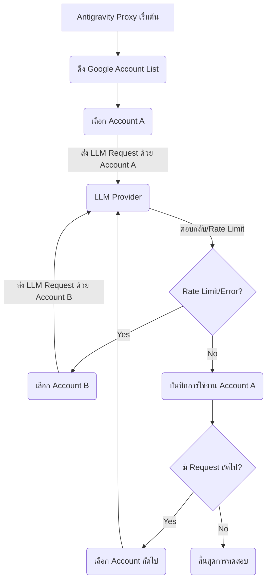
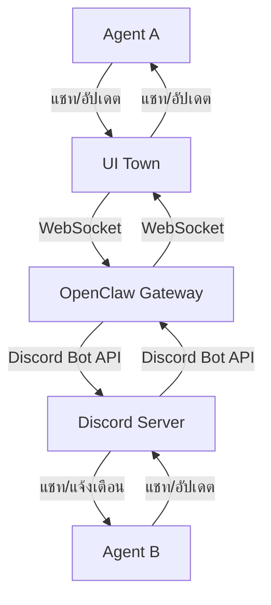

# แผนแม่บทบริษัท Agentic (Agentic Company Master Plan)

เอกสารนี้รวบรวมแผนการออกแบบและพัฒนาบริษัท Agentic แบบเต็มรูปแบบ โดยมีเป้าหมายเพื่อสร้างระบบ AI Agent ที่สามารถทำงานได้ด้วยตนเอง 100% ผสมผสาน Open-Source Frameworks เข้าด้วยกันภายใต้ Flow การทำงานของ OpenClaw โดยเน้นการทำงานแบบ Hybrid Agent System ที่มีทั้ง Agent ถาวร (Persistent Swarm Workers) และ Agent ชั่วคราว (Spawn-on-Demand Workers) เพื่อประสิทธิภาพและความยืดหยุ่นสูงสุด

## 1. วิสัยทัศน์และเป้าหมาย

สร้างบริษัท AI Agent ที่สามารถดำเนินงานได้อย่างอิสระ มีความสามารถในการตัดสินใจ, วางแผน, ดำเนินการ, และเรียนรู้จากประสบการณ์ เพื่อตอบสนองต่อคำสั่งของบอส (มนุษย์) และขับเคลื่อนการพัฒนาผลิตภัณฑ์/บริการอย่างต่อเนื่องและมีประสิทธิภาพสูงสุด

## 2. โครงสร้างบริษัท Agent และหน้าที่ (สรุป)

บริษัท Agentic จะจำลองโครงสร้างองค์กรจริง โดยมี AI Agent ทำหน้าที่เป็นพนักงานในตำแหน่งต่างๆ และมี CEO เป็นศูนย์กลางในการบริหารจัดการ Agent ทั้งหมดจะถูกแบ่งเป็น 2 ประเภทหลัก:

*   **Persistent Swarm Workers:** Agent หลักที่รันอยู่ตลอดเวลา 24/7 มี Memory ของตัวเอง และทำหน้าที่บริหารจัดการ, ตัดสินใจ, และเฝ้าระวังระบบ เช่น CEO, CTO, CMO, CSO, Accountant, DevOps Engineer, Dev Lead
*   **Spawn-on-Demand Workers:** Agent ที่ถูกสร้างขึ้นมาเฉพาะกิจตาม Task และจะถูกทำลายเมื่อทำงานเสร็จสิ้น เพื่อประหยัดทรัพยากรและเพิ่มความยืดหยุ่น เช่น Frontend Developer, Backend Developer, Debugger, Software Tester, Designer, Copywriter, Researcher, Hacker, RedTeam, Analyst, QA Engineer

**CEO Agent** จะเป็นตัวกลางในการสื่อสารทั้งหมดระหว่างบอสและ Agent อื่นๆ โดยมีหน้าที่หลักในการรับคำสั่ง, วางแผน, มอบหมายงาน, ติดตามความคืบหน้า, และรายงานผลให้บอสทราบเท่านั้น Agent อื่นๆ จะไม่สามารถติดต่อบอสได้โดยตรง

## 3. สถาปัตยกรรมระบบ (ภาพรวม)

ระบบ Agentic จะถูกสร้างขึ้นบนพื้นฐานของ OpenClaw Gateway ที่ทำหน้าที่เป็น Hub กลางในการเชื่อมต่อและสื่อสารระหว่างส่วนประกอบต่างๆ โดยมี Antigravity Proxy สำหรับจัดการการเข้าถึง LLM และระบบ Memory ที่ซับซ้อนเพื่อรองรับ Persistent Agent

*   **OpenClaw Gateway:** Hub กลางในการเชื่อมต่อ Agent, UI Town, Discord, และ Telegram
*   **UI Town (Agent Town):** แพลตฟอร์ม UI สำหรับ Agent ในการทำงานร่วมกันและบอสใช้ติดตามสถานะ
*   **Discord Server:** ช่องทางการสื่อสารหลักระหว่าง Agent และการแจ้งเตือนต่างๆ
*   **Antigravity Proxy:** ระบบจัดการการเข้าถึง LLM (Opus 4.6 Think, Gemini 3 Pro High) พร้อมกลไก Account Rotation และ Load Balancing สำหรับ Google Account จำนวน 10-20 บัญชี
*   **Persistent Agent Layer:** ชั้นการทำงานสำหรับ Agent ถาวร พร้อม Agent Process Manager และ Memory/State Management
*   **Spawn Manager:** ระบบจัดการการสร้างและยุติ Spawn-on-Demand Workers ตาม Task
*   **Memory System:** ประกอบด้วย Short-term Memory (Redis), Long-term Memory (Vector DB/PostgreSQL), และ Shared Memory (Redis/Message Queue) เพื่อให้ Agent มีความจำและบริบทที่ต่อเนื่อง
*   **Language Translation Layer:** ระบบแปลภาษาอัตโนมัติ (ไทย <-> อังกฤษ) สำหรับการสื่อสารกับ LLM Provider และบอส

## 4. Flow การทำงานหลัก (สรุป)

1.  **Boss Command:** บอสส่งคำสั่งผ่าน Telegram หรือ TUI CLI OpenClaw
2.  **CEO Ingestion & Planning:** CEO Agent รับคำสั่ง, วิเคราะห์, วางแผน, และสร้าง Roadmap
3.  **Task Assignment:** CEO มอบหมาย Task ให้ Persistent Agent หรือสั่ง Spawn-on-Demand Worker ผ่าน Spawn Manager
4.  **Agent Execution:** Agent ดำเนินการตาม Task โดยใช้ LLM และ Tools ที่มี
5.  **Collaboration:** Agent สื่อสารและทำงานร่วมกันผ่าน Discord และ UI Town
6.  **Review & Debug:** งานที่เสร็จสิ้นจะถูกตรวจสอบ, หาบัค, และแก้ไข
7.  **Reporting to CEO:** Agent รายงานผลกลับไปยัง CEO
8.  **CEO Consolidation & Reporting to Boss:** CEO สรุปผลและรายงานให้บอสทราบ (เฉพาะงานที่เสร็จสมบูรณ์)

## 5. Roadmap การพัฒนา (สรุป)

การพัฒนาจะแบ่งออกเป็น 3 Phase หลัก:

*   **Phase 1: สร้าง Persistent Agent Layer + Memory System:** เน้นการสร้างรากฐานสำหรับ Agent ถาวรและระบบความจำ
*   **Phase 2: สร้าง Spawn Manager + เชื่อมต่อทุกระบบ:** พัฒนาระบบ Spawn Agent ชั่วคราวและเชื่อมต่อการทำงานแบบ Hybrid
*   **Phase 3: Scale-up + Optimize:** ขยายระบบ, เพิ่มประเภท Agent, และปรับปรุงประสิทธิภาพโดยรวม

## 6. Open-Source ที่แนะนำ (สรุป)

จะมีการนำ Open-Source Tools และ Frameworks ต่างๆ มาประยุกต์ใช้ เช่น LangGraph, CrewAI/AutoGen สำหรับ Agent Frameworks; Redis, ChromaDB, PostgreSQL สำหรับ Memory & Database; PM2, RabbitMQ/Kafka สำหรับ Process Management; และ LiteLLM/LiteLLM Proxy สำหรับ LLM Proxy & Load Balancing


## 7. LLM Login Account Management

เพื่อให้ระบบ Agentic สามารถทำงานได้อย่างต่อเนื่องและมีประสิทธิภาพสูงสุด โดยเฉพาะอย่างยิ่งเมื่อต้องมีการเรียกใช้ LLM (Large Language Models) จำนวนมาก ระบบจะมีการจัดการบัญชี LLM ที่ซับซ้อนเพื่อรองรับการใช้งานและหลีกเลี่ยงข้อจำกัด (Rate Limit) ของผู้ให้บริการ

### 7.1 แผนรองรับ Google Account สำหรับ LLM

*   **จำนวนบัญชี:** วางแผนรองรับ Google Account จำนวน 10-20 บัญชี สำหรับการเข้าถึง LLM เช่น Opus 4.6 Think และ Gemini 3 Pro High
*   **วัตถุประสงค์:** การมีบัญชีจำนวนมากจะช่วยกระจายโหลดการใช้งาน และลดความเสี่ยงที่จะถูกจำกัดการใช้งาน (Rate Limit) จากผู้ให้บริการ LLM

### 7.2 ระบบ Account Rotation / Load Balancing

ระบบ Antigravity Proxy จะทำหน้าที่เป็นตัวกลางในการจัดการบัญชี LLM ทั้งหมด โดยมีกลไกสำคัญดังนี้:

*   **Account Pool:** บัญชี Google Account ทั้งหมดจะถูกจัดเก็บไว้ใน Account Pool ที่ Antigravity Proxy สามารถเข้าถึงได้
*   **Rotation Strategy:** Antigravity Proxy จะสลับใช้บัญชี Google Account ในการส่ง Request ไปยัง LLM Provider ตามกลยุทธ์ที่กำหนด เช่น Round-robin, Least-used, หรือ Weighted Round-robin
*   **Load Balancing:** ระบบจะกระจาย Request ไปยังบัญชีที่มีโหลดน้อยที่สุด หรือบัญชีที่ยังไม่ถึง Rate Limit เพื่อให้การเรียกใช้ LLM เป็นไปอย่างราบรื่นและต่อเนื่อง
*   **Error Handling:** หากบัญชีใดบัญชีหนึ่งเกิดปัญหา (เช่น ถูก Rate Limit ชั่วคราว) Antigravity Proxy จะทำการสลับไปใช้บัญชีอื่นโดยอัตโนมัติ

### 7.3 แผนทดสอบการสลับ Account จริง (Gmail Integration)

ผู้ใช้ได้เชื่อมต่อ Gmail ไว้ให้ทดสอบแล้ว ซึ่งจะถูกนำมาใช้ในการทดสอบกลไก Account Rotation และ Load Balancing ของ Antigravity Proxy

*   **วัตถุประสงค์การทดสอบ:**
    *   **ทดสอบการ Login:** ตรวจสอบว่า Antigravity Proxy สามารถ Login เข้าสู่ Google Account ที่เชื่อมต่อไว้ได้สำเร็จ
    *   **ทดสอบ Account Switching:** ตรวจสอบว่า Antigravity Proxy สามารถสลับใช้บัญชี Google Account ในการส่ง Request ไปยัง LLM Provider ได้อย่างถูกต้องและราบรื่น
    *   **ทดสอบ Rate Limiting:** จำลองสถานการณ์ที่บัญชีใดบัญชีหนึ่งถูก Rate Limit และตรวจสอบว่าระบบสามารถสลับไปใช้บัญชีอื่นได้โดยอัตโนมัติ
    *   **ทดสอบ Error Handling:** ตรวจสอบการจัดการ Error เมื่อบัญชีใดบัญชีหนึ่งไม่สามารถใช้งานได้
    *   **ทดสอบ Performance:** วัดประสิทธิภาพของการสลับบัญชีและ Load Balancing ภายใต้โหลดการใช้งานที่แตกต่างกัน

*   **Flow การทดสอบ Account Switching:**



**คำอธิบาย Flow:**

1.  **Antigravity Proxy เริ่มต้น:** ระบบ Antigravity Proxy เริ่มทำงาน
2.  **ดึง Google Account List:** ดึงรายการ Google Account ทั้งหมดที่พร้อมใช้งาน
3.  **เลือก Account A:** เลือกบัญชีแรกจาก Pool (เช่น Account A)
4.  **ส่ง LLM Request ด้วย Account A:** ส่ง Request ไปยัง LLM Provider โดยใช้ Account A
5.  **ตอบกลับ/Rate Limit:** LLM Provider ตอบกลับ หรือแจ้งว่าถึง Rate Limit
6.  **Rate Limit/Error?:** หากพบว่าถึง Rate Limit หรือมี Error
7.  **เลือก Account B:** Antigravity Proxy จะสลับไปใช้บัญชีอื่น (เช่น Account B)
8.  **ส่ง LLM Request ด้วย Account B:** ส่ง Request ไปยัง LLM Provider โดยใช้ Account B
9.  **บันทึกการใช้งาน Account A:** หากไม่มีปัญหา Antigravity Proxy จะบันทึกการใช้งานของ Account A
10. **มี Request ถัดไป?:** ตรวจสอบว่ามี Request ถัดไปหรือไม่
11. **เลือก Account ถัดไป:** หากมี Request ถัดไป จะเลือกบัญชีถัดไปตามกลยุทธ์ Rotation
12. **สิ้นสุดการทดสอบ:** หากไม่มี Request แล้ว การทดสอบจะสิ้นสุดลง

## 8. Flow Diagram อธิบายภาพรวม

### 8.1 Flow หลักของบริษัท (Boss -> CEO -> Agents)

```mermaid
graph TD
    Boss[บอส (มนุษย์)] -- คำสั่ง (Telegram/TUI) --> CEO[CEO Agent (Persistent)]
    CEO -- วางแผน/มอบหมาย --> AgentPool[Agent Pool (Persistent & Spawned)]
    AgentPool -- ทำงาน/สื่อสาร --> Memory[Memory System]
    AgentPool -- ใช้ LLM --> AntigravityProxy[Antigravity Proxy]
    AntigravityProxy -- แปลภาษา --> TranslationLayer[Translation Layer]
    TranslationLayer -- LLM API --> LLMProvider[LLM Provider]
    LLMProvider -- ผลลัพธ์ --> TranslationLayer
    TranslationLayer -- ผลลัพธ์ --> AntigravityProxy
    AntigravityProxy -- ผลลัพธ์ --> AgentPool
    AgentPool -- รายงานผล/สถานะ --> CEO
    CEO -- สรุป/รายงาน/เสนอเทรนด์ --> Boss
```

### 8.2 Flow การสื่อสารระหว่าง Agent (Discord + UI Town)



### 8.3 Flow การแจ้งเตือนเงินเข้าออก 24/7

```mermaid
graph TD
    Accountant[Accountant Agent (Persistent)] -- เฝ้าระวัง 24/7 --> BankAPI[Bank API/Payment Gateway]
    BankAPI -- ตรวจพบธุรกรรม --> Accountant
    Accountant -- สร้างข้อความแจ้งเตือน --> DiscordWebhook[Discord Webhook]
    DiscordWebhook -- ส่งไปยัง --> FinanceChannel[Discord: #finance-alerts]
```

### 8.4 Flow LLM Account Rotation

```mermaid
graph TD
    Agent[Agent (ต้องการใช้ LLM)] --> AntigravityProxy[Antigravity Proxy]
    AntigravityProxy -- เลือก Account (Rotation/Load Balancing) --> GoogleAccount[Google Account (1-20)]
    GoogleAccount -- ส่ง Request --> LLMProvider[LLM Provider]
    LLMProvider -- ตอบกลับ --> GoogleAccount
    GoogleAccount -- ผลลัพธ์ --> AntigravityProxy
    AntigravityProxy -- ผลลัพธ์ --> Agent
```

### 8.5 Flow การพัฒนา (Dev Pipeline)

```mermaid
graph TD
    CEO -- มอบหมายงาน Dev --> CTO[CTO Agent (Persistent)]
    CTO -- วางแผน/มอบหมาย --> DevLead[Dev Lead (Spawned)]
    DevLead -- แบ่งงาน --> FrontendDev[Frontend Dev (Spawned)]
    DevLead -- แบ่งงาน --> BackendDev[Backend Dev (Spawned)]
    FrontendDev -- เขียน Code --> CodeRepo[Code Repository]
    BackendDev -- เขียน Code --> CodeRepo
    CodeRepo -- CI/CD Trigger --> DevOps[DevOps Engineer (Persistent)]
    DevOps -- Deploy --> Staging[Staging Environment]
    Staging -- ทดสอบ --> SoftwareTester[Software Tester (Spawned)]
    SoftwareTester -- รายงาน Bug --> CTO
    CTO -- สั่ง Debug --> Debugger[Debugger (Spawned)]
    Debugger -- แก้ไข Code --> CodeRepo
```

### 8.6 Flow Security (Hacker/RedTeam)

```mermaid
graph TD
    CTO -- สั่งทดสอบความปลอดภัย --> RedTeam[RedTeam (Spawned)]
    RedTeam -- ทดสอบเจาะระบบ --> System[Production System]
    System -- พบช่องโหว่ --> RedTeam
    RedTeam -- รายงานช่องโหว่ --> CTO
    CTO -- สั่งแก้ไข --> DevOps
    DevOps -- แก้ไข/Patch --> System
```

### 8.7 Flow Marketing & Content

```mermaid
graph TD
    CEO -- มอบหมายงาน Marketing --> CMO[CMO Agent (Persistent)]
    CMO -- วางแผนแคมเปญ --> Copywriter[Copywriter (Spawned)]
    CMO -- วางแผนแคมเปญ --> Designer[Designer (Spawned)]
    Copywriter -- สร้าง Content --> ContentRepo[Content Repository]
    Designer -- สร้าง Graphic --> ContentRepo
    ContentRepo -- อนุมัติ --> CMO
    CMO -- เผยแพร่ --> MarketingChannels[Marketing Channels]
```

### 8.8 Flow Research & Strategy

```mermaid
graph TD
    CEO -- มอบหมายงาน Research --> CSO[CSO Agent (Persistent)]
    CSO -- วางแผน Research --> Researcher[Researcher (Spawned)]
    CSO -- วางแผน Strategy --> Strategist[Strategist (Spawned)]
    Researcher -- รวบรวมข้อมูล --> DataSources[External Data Sources]
    DataSources -- ข้อมูล --> Researcher
    Researcher -- วิเคราะห์ข้อมูล --> Analyst[Analyst (Spawned)]
    Analyst -- สรุป Insight --> CSO
    Strategist -- วางกลยุทธ์ --> CSO
    CSO -- เสนอต่อ --> CEO
```

### 8.9 Flow QA & Testing

```mermaid
graph TD
    DevOps -- Deploy to Staging --> StagingEnv[Staging Environment]
    StagingEnv -- ทดสอบ --> SoftwareTester[Software Tester (Spawned)]
    SoftwareTester -- พบ Bug --> BugReport[Bug Report]
    BugReport -- ส่งไปยัง --> CTO
    CTO -- มอบหมายแก้ไข --> Debugger[Debugger (Spawned)]
    Debugger -- แก้ไข Code --> CodeRepo[Code Repository]
    CodeRepo -- CI/CD --> DevOps
```

### 8.10 Flow DevOps & Deployment

```mermaid
graph TD
    CodeRepo[Code Repository] -- Push Code --> CI_CD[CI/CD Pipeline (DevOps Engineer)]
    CI_CD -- Build & Test --> Artifacts[Build Artifacts]
    Artifacts -- Deploy --> Production[Production Environment]
    Production -- Monitoring --> DevOps
    DevOps -- Alert --> CTO
```

## 9. Roadmap การพัฒนา

(ดูรายละเอียดเพิ่มเติมใน `docs/DEVELOPMENT_ROADMAP.md`)

## 10. Open-Source Tools/Frameworks ที่แนะนำ

(ดูรายละเอียดเพิ่มเติมใน `docs/DEVELOPMENT_ROADMAP.md`)
